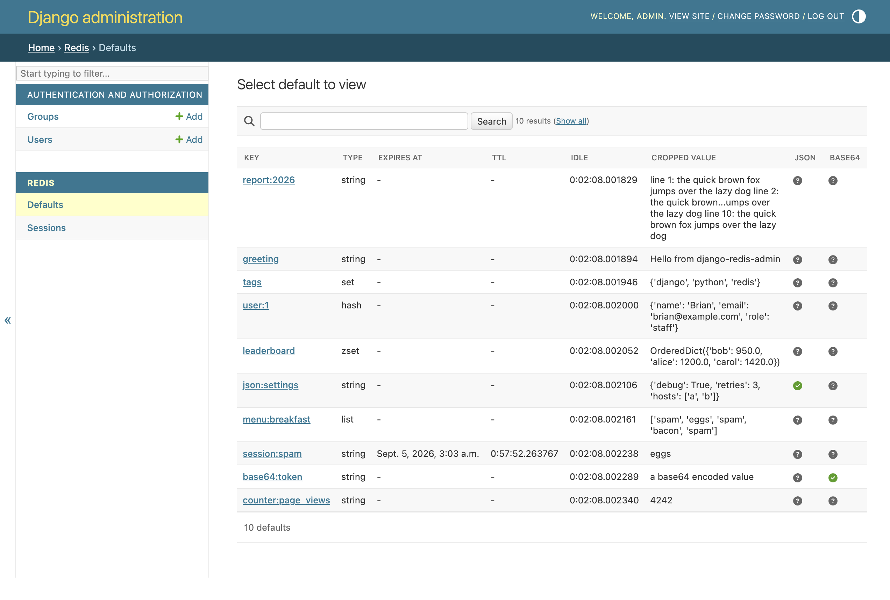

# Django Redis Admin

**Browse every key on your Redis servers from the Django admin you already have.**



You have a Redis server next to your Django project and a question about it:
which keys are in there, what do they hold, and when do they expire? Answering
that from `redis-cli` means remembering `SCAN`, `TYPE`, `PTTL` and a decoder
for whatever your code stored. `django-redis-admin` puts the same answers in
the Django admin as a searchable, paginated list with one page per key.

The trick underneath is small. A fake queryset talks to Redis with `SCAN` and a
pipeline of `TYPE`, `PTTL` and `OBJECT IDLETIME`, and the `ModelAdmin` never
notices it isn't looking at a database table. Because Redis only stores bytes,
the admin can decode JSON and base64 values for you, selected by a regular
expression on the key.

## Highlights

- **Every server, every key type.** Strings, lists, sets, hashes and sorted
  sets from plain servers, master and replica pairs, or Redis Sentinel.
- **Search and pagination that map onto `SCAN`.** `exact`, `startswith`,
  `endswith` and `contains` lookups on the key become glob patterns.
- **Decoding by key pattern.** JSON and base64 values are decoded before they
  are shown, and the list flags which keys matched.
- **Exclusions for keys that aren't yours.** Hide pickled `constance:` values
  or session stores by prefix, regular expression or exact key.
- **Read-only by design.** Add, change and delete are refused at the endpoint,
  so a staff account with the view permission can look but never touch.
- **Typed and tested.** Ships `py.typed`, passes mypy, basedpyright and pyrefly
  in strict mode, and runs at 100% line and branch coverage on Python 3.10 to
  3.14 and PyPy with Django 4.2 to 6.1.

New here? Start with the {doc}`quickstart`, then take the {doc}`tour`.

```{toctree}
:maxdepth: 2
:caption: Guides

quickstart
tour
configuration
demo
development
```

```{toctree}
:maxdepth: 2
:caption: Reference

redis_admin
```

## Indices and tables

- {ref}`genindex`
- {ref}`modindex`
- {ref}`search`
