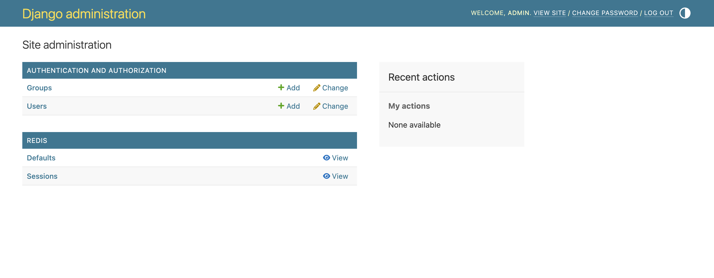

# Quick start

Two steps get a Redis on `localhost:6379` into the admin. A third points the
admin at other servers.

## Install

```bash
pip install django-redis-admin
```

Or with uv:

```bash
uv add django-redis-admin
```

Python 3.10 or newer and Django 4.2 or newer are required. The only other
runtime dependencies are `redis` and `typing-extensions`.

## Enable the app

Add `redis_admin` to `INSTALLED_APPS`. The Django admin itself has to be
installed and routed, which it is in every project created with
`startproject`:

```python
INSTALLED_APPS = [
    ...,
    'django.contrib.admin',
    'redis_admin',
]
```

Start the server and open `/admin/`. A **Redis** section appears with a
**Default** entry that lists the keys on `localhost:6379`, database `0`:



The entry offers **View** rather than **Add** or **Change**. The admin refuses
writes at the endpoint, so nothing on these pages can modify Redis.

## Point it at your servers

Every entry in `REDIS_SERVERS` becomes its own admin page. The options are
passed to `redis.Redis()`, so anything the client accepts works here:

```python
REDIS_SERVERS = {
    'cache': {'host': 'redis.internal', 'port': 6379, 'db': 1},
    'sessions': {'host': 'redis.internal', 'port': 6379, 'db': 2},
}
```

Master and replica pairs, Sentinel, decoding and exclusions are covered in
{doc}`configuration`.

```{note}
The admin page is named after the dictionary key, so `cache` shows up as
**Caches**. Set a `meta` dictionary with `verbose_name` and
`verbose_name_plural` on the server to pick your own label. The
{doc}`configuration` page shows the syntax.
```

## Give staff access

Superusers see everything. Other staff accounts need the view permission for
each server. Django creates one per configured server, named after the entry,
so grant `redis_admin | default | Can view default` and its siblings through
the **Users** or **Groups** admin.

The add, change and delete permissions exist too, because Django creates them
for every model, but the admin ignores them. Granting them changes nothing.
