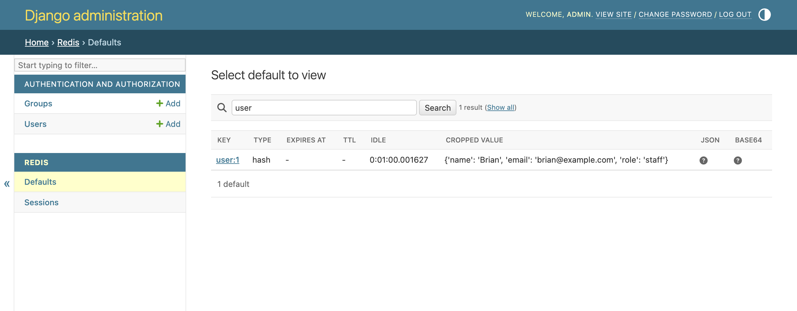
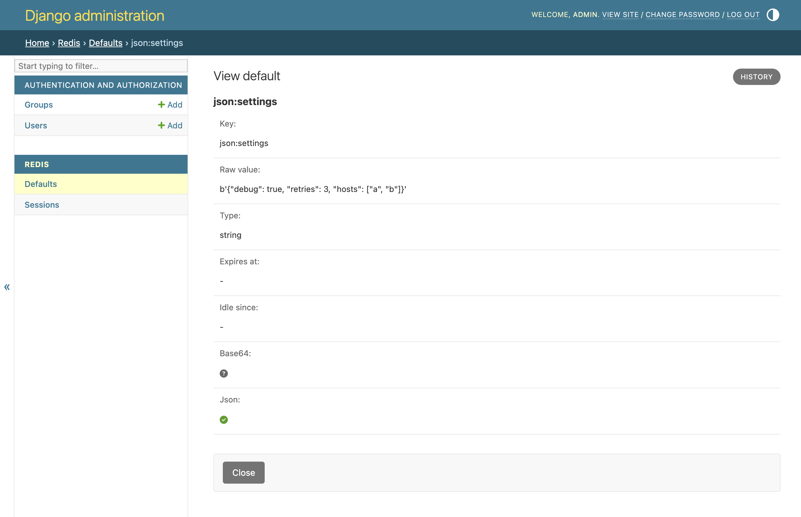
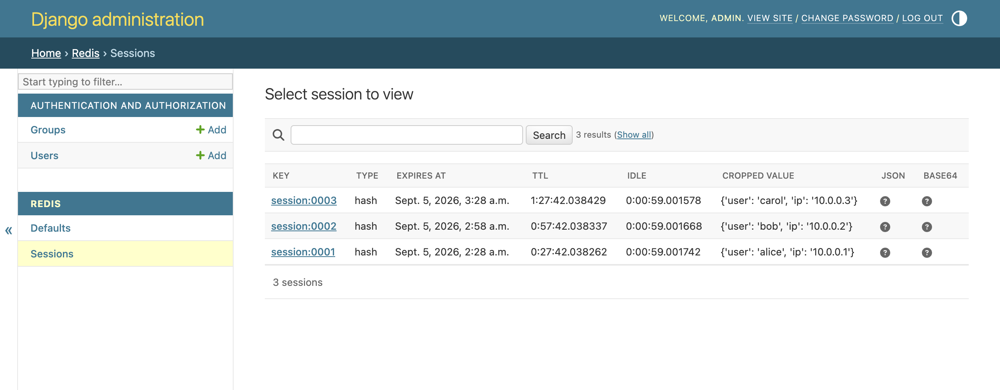

# A tour of the admin

Every screenshot on this page comes from the {doc}`demo` project, which seeds a
local Redis with one key of every type. Run it yourself to click along.

## The key list

Opening a server shows its keys in the order `SCAN` returns them:


Reading the columns from left to right:

- **Key** links to the detail page.
- **Type** is the Redis type: `string`, `list`, `set`, `hash` or `zset`.
- **Expires at** and **TTL** come from `PTTL`. Keys without an expiry show a
  dash, like every key here except `session:spam`.
- **Idle** comes from `OBJECT IDLETIME` and shows how long ago the key was
  last touched. The seeding script wrote all of these in one go, which is why
  the idle times are within milliseconds of each other.
- **Cropped value** is the decoded value, cut to `REDIS_REPR_CROP_SIZE`
  characters with the middle replaced by `...`. The `report:2026` row shows
  the cropping.
- **JSON** and **Base64** report whether decoding applied. A green tick means
  the key matched the pattern and decoded, a question mark means the pattern
  did not match, and a red cross means the pattern matched but the value would
  not decode.

The `constance:SITE_NAME` key that the demo also writes is missing from the
list. The demo settings exclude the `constance:` prefix because the value is a
pickle, and the admin has no business decoding pickles.

```{note}
The count at the bottom of the page comes from `INFO keyspace` and covers the
whole database. It is cheap, which is why the admin uses it, but it does not
shrink when you search. The count next to the search box is the size of the
filtered result instead.
```

## Searching

The search box filters on the key. Django's `key__contains` lookup becomes a
`*user*` pattern for `SCAN`, so a search for `user` finds `user:1`:



Four lookups are supported and all of them turn into glob patterns: `exact`
matches the key as typed, `startswith` appends `*`, `endswith` prepends it, and
`contains` does both. Redis has no other way to filter keys server-side, so
anything else raises an error instead of silently scanning everything.

## The detail page

A key's page shows the raw bytes as Redis returned them next to the decoded
value, plus the same expiry, idle and decoding fields as the list:



The `json:settings` key matched `REDIS_JSON_KEY_RE`, so the value in the list
is a Python dictionary and the JSON flag is a tick. The raw value keeps the
bytes so you can see what your application actually stored.

Sorted sets show as an ordered mapping from member to score:


The only button is **Close**. There is no save button and no delete link,
because `RedisAdmin` refuses change and delete permissions for everyone. A
request to the change or delete URL, whether from a form or a script, gets a
403 response.

## More than one server

Each entry in `REDIS_SERVERS` is a separate admin page with its own key list.
The demo configures a second entry, `sessions`, that points at database `1`
on the same Redis and holds hashes with a time to live:



The label reads **Sessions** because the demo sets `verbose_name` in the
server's `meta` dictionary. Without it the page would be named after the
dictionary key, capitalised.
